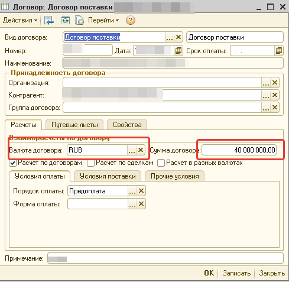

# Моя Бухгалтерия

## Контроль сумм и сроков валютных договоров для регистрации nbrb.by
* `mkdocs new [dir-name]` - Create a new project.
* `mkdocs serve` - Start the live-reloading docs server.
* `mkdocs build` - Build the documentation site.
* `mkdocs -h` - Print help message and exit.

    Контроль настроен для контрагентов - нерезидентов РБ
    Для справочника обязательно заполнить валюту договора, сумму договора
    
<!-- {: style="width:300px; height:auto;"} -->
